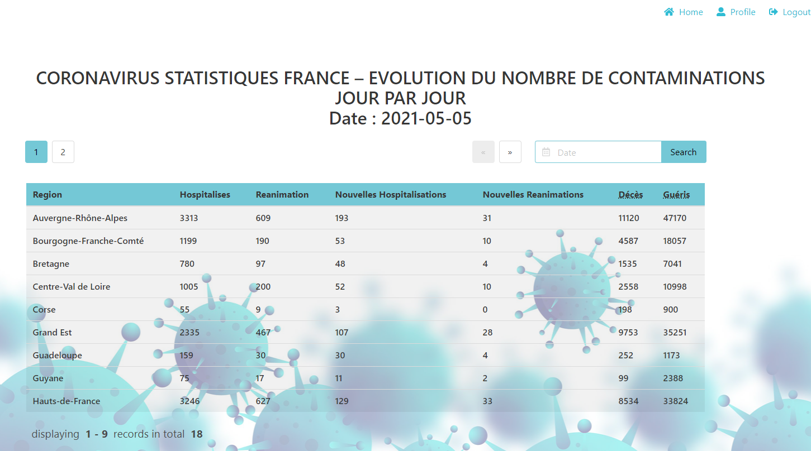
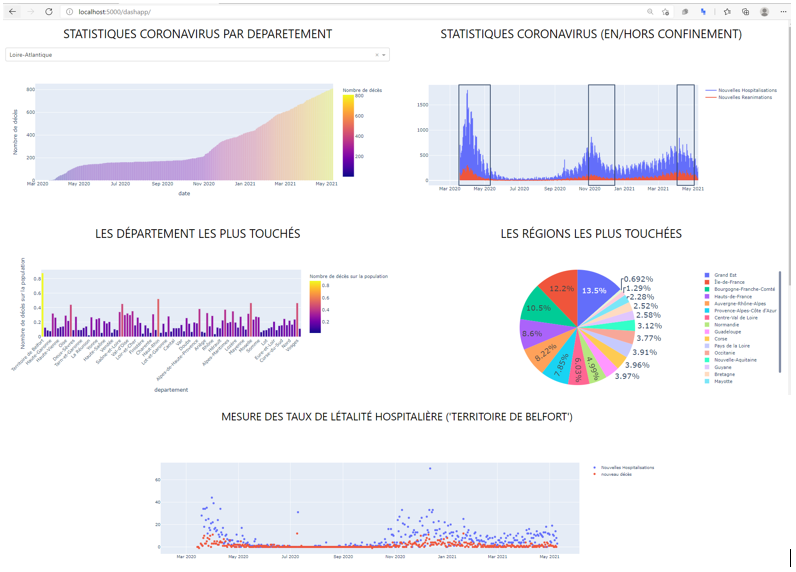

# projet-chef-d-oeuvre

#### Contexte du projet:
Dans le cadre du passage des certifications Développeur Data, n°3497 "Développer une base de données"
et n°3508 "Exploiter une base de données", je m'intéresse à l’évolution quotidienne de la pandémie en France.

Pour atteindre nos objectifs, j'ai été amenée à développer une application web sous le nom de "COVID-APP", cette application va permettre à l’utilisateur de consulter la dernière mise à jour des données relatives à la covid-19 et d’accéder aux statistiques et analyses réalisées.

Le dépo contient Tout document nécessaire pour la compréhension du projet :

- Conception UML : Conception statique et dynamique technique du projet 
- Covid-app : tout script python permet le fonctionnement de l'application Covid-app  
- Documentation : rapport final 
- gestion de projet : diagramme de gant
- requierements.txt : toutes librairie nécessaire pour le l'exécution de l'application

Pour Installer Covid_app :
- Installer les prérequis avec la commande "pip install -r requirements.txt"
- Créer une base de données type postgresql. 
- Exécuter models.py et createView/py pour créer les tables et les vues 
- Pour alimenter la BDD pensez à lancer initialiser->app.py
- Lancer updater-> app.py pour mettre à jour la BDD quotidiennement

